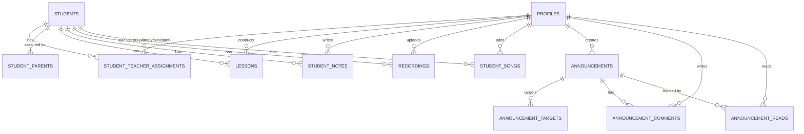

# Music Lab — Business Logic & Database Reference

**Project:** Music Lab — Internal School Operations & Progress Tracking App
**Stack:** HTML / CSS / Vanilla JS + Bootstrap 5.3 + Vite + Supabase + Netlify
**Status:** MVP Delivered — March 2026

---

## 1. BUSINESS LOGIC

### 1.1 Core Goal

Centralize all student progress, teacher activity and internal communications for a music school into one secure, role-based system. Replaces fragmented group chats (Viber, WhatsApp) with structured, auditable records.

---

### 1.2 User Roles

| Role | Description |
|------|-------------|
| `admin` | School owner / manager — unrestricted access to all data and operations |
| `teacher` | Instructor — access scoped to assigned students only |

Parents are **not** system users. They appear as contact records on student profiles (`student_parents` table).

---

### 1.3 Teacher ↔ Student Access Model

Access is managed through the `student_teacher_assignments` table.

**Assignment types:**

| Type | Rule |
|------|------|
| `primary` | `active_to IS NULL` — permanent relationship, no end date |
| `assistant` | `(active_from IS NULL OR now() >= active_from) AND (active_to IS NULL OR now() < active_to)` |

A teacher has access to a student **only if** a valid assignment record exists.

This rule is enforced consistently across:
- Students (visibility in list and detail)
- Lessons (create / read / update)
- Student Notes
- Recordings
- Songs (Repertoire)

Admin bypasses all access restrictions via RLS policy.

---

### 1.4 Assignment Management Rules

- Each student has **exactly one active primary teacher** at any time (enforced by partial unique index)
- Primary teacher is assigned when creating a student, or reassigned via the Students list (closes previous primary assignment by setting `active_to = now()`, opens new)
- Primary teacher **cannot be deleted** from the student detail Info tab — reassignment is the correct flow
- Assistant teachers can be:
  - Added with optional `active_from` / `active_to` dates
  - Edited (dates only) inline on the student Info tab
  - Deleted permanently (admin only)

---

### 1.5 Permissions Summary

#### Admin
- Full CRUD on: teachers (profiles), students, parents, teacher assignments, lessons (soft delete), notes (soft delete), recordings (soft delete), songs, announcements, announcement targets, comments (moderation), read tracking
- Invite new teachers (Supabase email invite)
- Deactivate / reactivate teachers and students
- Access to admin dashboard analytics (all teachers, all students, all lessons)
- Google Calendar access

#### Teacher
- Edit own profile only
- Read-only teacher directory (all teachers' contacts visible)
- Students: only assigned students (primary + active assistant)
- Lessons: create / update for assigned students; no delete
- Notes: create / update for assigned students; delete own notes if primary teacher
- Recordings: upload / view for assigned students; delete if primary teacher
- Songs: create / update for assigned students; delete if primary teacher
- Announcements: read if audience includes them; full CRUD on own comments
- Google Calendar access

---

### 1.6 Soft Delete Pattern

Soft delete is used for audit-sensitive records:

| Table | Column | Hard delete? |
|-------|--------|-------------|
| `lessons` | `deleted_at` | Admin only (sets deleted_at) |
| `student_notes` | `deleted_at` | Primary teacher + admin |
| `recordings` | `deleted_at` | Primary teacher + admin |
| `announcement_comments` | `deleted_at` | Owner + admin |
| `student_songs` | — | Hard delete (primary teacher + admin) |
| `student_parents` | — | Hard delete (admin only) |
| `student_teacher_assignments` | — | Hard delete (admin only) |
| `announcements` | — | Hard delete (admin only) |

All service queries filter `WHERE deleted_at IS NULL` by default.

---

### 1.7 Announcement Visibility Logic

A teacher sees an announcement only if **all** of the following are true:

1. `audience_type = 'all_teachers'` OR a matching `announcement_targets` record exists for their `teacher_id`
2. `starts_at IS NULL OR now() >= starts_at`
3. `ends_at IS NULL OR now() <= ends_at`

Admin sees all announcements regardless of audience or schedule. Admin can additionally toggle "Show expired" to view past announcements.

**Unread tracking:** On opening an announcement detail, a row is inserted into `announcement_reads` (if not already present). RLS scopes this table to the current user, so empty result = unread.

---

### 1.8 Google Calendar — Business Rules

- Available to all authenticated users (admin + teacher)
- Each user independently connects their own Google account
- Connection is scoped to the Supabase user ID — logging in as a different Supabase user automatically clears any previously stored Google connection
- OAuth 2.0 access token is stored in `sessionStorage` (cleared on tab/browser close)
- Connected Google email stored in `localStorage` keyed by Supabase user ID
- On `TOKEN_EXPIRED` (401): auto re-consent flow is triggered
- On `INSUFFICIENT_SCOPES` (403): force re-consent with full scope list
- Events operate on the user's **primary** Google Calendar only
- Maximum 250 events fetched per time window (Google API limit)

---

### 1.9 Data Sorting Rules (Global)

| Entity | Sort |
|--------|------|
| Lessons | `held_at DESC` |
| Student Notes | `created_at DESC` |
| Recordings | `recorded_at DESC` |
| Announcements | `created_at DESC` |
| Songs | `status ASC`, then `created_at DESC` |
| Students | `first_name ASC` (default) |
| Teachers | `first_name ASC` (default, sortable) |

Songs sort is a special case: status order is `planned → started → completed`, keeping active work at the top.

---

## 2. DATABASE MODEL

### 2.1 Conventions

| Convention | Value |
|------------|-------|
| Primary keys | `uuid DEFAULT gen_random_uuid()` |
| Timestamps | `timestamptz DEFAULT now()` |
| Soft deletes | `deleted_at timestamptz` — null means not deleted |
| FK behavior | `ON DELETE CASCADE` for child tables |

---

### 2.2 `profiles` — User Metadata & Role

Mirrors `auth.users`. One row per authenticated user.

| Column | Type | Notes |
|--------|------|-------|
| `id` | uuid PK | = `auth.users.id` |
| `role` | text | `'admin'` \| `'teacher'` |
| `first_name` | text | |
| `last_name` | text | |
| `phone` | text nullable | |
| `email` | text nullable | |
| `instagram` | text nullable | |
| `birth_date` | date nullable | |
| `created_at` | timestamptz | |

---

### 2.3 `students`

| Column | Type | Notes |
|--------|------|-------|
| `id` | uuid PK | |
| `created_by` | uuid FK → profiles.id | Admin who created the student |
| `first_name` | text | |
| `last_name` | text | |
| `phone` | text nullable | |
| `email` | text nullable | |
| `birth_date` | date nullable | |
| `is_active` | boolean default true | Deactivation flag |
| `created_at` | timestamptz | |
| `updated_at` | timestamptz | |

---

### 2.4 `student_parents`

Up to N parents / guardians per student.

| Column | Type | Notes |
|--------|------|-------|
| `id` | uuid PK | |
| `student_id` | uuid FK → students.id CASCADE | |
| `full_name` | text | |
| `relation` | text | `'mother'` \| `'father'` \| `'guardian'` |
| `phone` | text nullable | |
| `email` | text nullable | |
| `occupation` | text nullable | |
| `notes` | text nullable | |
| `social_links` | jsonb nullable | Reserved for future use |
| `created_at` | timestamptz | |

---

### 2.5 `student_teacher_assignments`

Controls which teachers have access to which students.

| Column | Type | Notes |
|--------|------|-------|
| `id` | uuid PK | |
| `student_id` | uuid FK → students.id CASCADE | |
| `teacher_id` | uuid FK → profiles.id | |
| `role` | text | `'primary'` \| `'assistant'` |
| `active_from` | timestamptz nullable | Null = immediate |
| `active_to` | timestamptz nullable | Null = open-ended |
| `created_by` | uuid FK → profiles.id | Admin who created it |
| `created_at` | timestamptz | |

**Constraint:** Partial unique index on `(student_id) WHERE role = 'primary' AND active_to IS NULL` — enforces exactly one active primary teacher per student.

---

### 2.6 `lessons`

| Column | Type | Notes |
|--------|------|-------|
| `id` | uuid PK | |
| `student_id` | uuid FK → students.id CASCADE | |
| `teacher_id` | uuid FK → profiles.id | Teacher who conducted the lesson |
| `held_at` | timestamptz | Lesson date and time |
| `vocal_technique` | text nullable | Practice notes |
| `song_notes` | text nullable | What was worked on |
| `homework` | text nullable | Assignment for next lesson |
| `deleted_at` | timestamptz nullable | Soft delete |
| `created_at` | timestamptz | |
| `updated_at` | timestamptz | |

---

### 2.7 `student_notes`

General journal / observation notes per student.

| Column | Type | Notes |
|--------|------|-------|
| `id` | uuid PK | |
| `student_id` | uuid FK → students.id CASCADE | |
| `teacher_id` | uuid FK → profiles.id | Author |
| `body` | text | Note content |
| `created_at` | timestamptz | |
| `updated_at` | timestamptz | |
| `deleted_at` | timestamptz nullable | Soft delete |

Delete rule: Primary teacher of the student or admin only.

---

### 2.8 `recordings`

Audio / video file metadata. Files stored in Supabase Storage bucket `recordings-private`.

| Column | Type | Notes |
|--------|------|-------|
| `id` | uuid PK | |
| `student_id` | uuid FK → students.id CASCADE | |
| `uploaded_by` | uuid FK → profiles.id | |
| `file_path` | text | Path within the storage bucket |
| `file_name` | text | Original filename |
| `mime_type` | text nullable | `audio/*` or `video/*` |
| `size_bytes` | bigint nullable | |
| `recorded_at` | timestamptz nullable | |
| `note` | text nullable | Optional description |
| `deleted_at` | timestamptz nullable | Soft delete |
| `created_at` | timestamptz | |

---

### 2.9 `student_songs`

Repertoire tracker per student.

| Column | Type | Notes |
|--------|------|-------|
| `id` | uuid PK | |
| `student_id` | uuid FK → students.id CASCADE | |
| `teacher_id` | uuid FK → profiles.id | Who added it |
| `song_name` | text | e.g. "APT — Bruno Mars" |
| `song_url` | text nullable | YouTube / Spotify link |
| `lyrics_url` | text nullable | |
| `notes` | text nullable | Practice notes |
| `status` | text NOT NULL default `'planned'` | `'planned'` \| `'started'` \| `'completed'` |
| `created_at` | timestamptz | |

---

### 2.10 `announcements`

| Column | Type | Notes |
|--------|------|-------|
| `id` | uuid PK | |
| `created_by` | uuid FK → profiles.id | Author (admin) |
| `title` | text | |
| `body` | text | Plain text, rendered with pre-wrap |
| `starts_at` | timestamptz nullable | Scheduled visibility start |
| `ends_at` | timestamptz nullable | Expiry date |
| `image_url` | text nullable | Optional banner image URL |
| `audience_type` | text | `'all_teachers'` \| `'selected_teachers'` |
| `created_at` | timestamptz | |
| `updated_at` | timestamptz | |

---

### 2.11 `announcement_targets`

Maps an announcement to specific teachers (used when `audience_type = 'selected_teachers'`).

| Column | Type | Notes |
|--------|------|-------|
| `id` | uuid PK | |
| `announcement_id` | uuid FK → announcements.id CASCADE | |
| `teacher_id` | uuid FK → profiles.id | |

---

### 2.12 `announcement_comments`

| Column | Type | Notes |
|--------|------|-------|
| `id` | uuid PK | |
| `announcement_id` | uuid FK → announcements.id CASCADE | |
| `author_id` | uuid FK → profiles.id | |
| `body` | text | |
| `created_at` | timestamptz | |
| `updated_at` | timestamptz | |
| `deleted_at` | timestamptz nullable | Soft delete |

---

### 2.13 `announcement_reads`

Tracks which users have read which announcements.

| Column | Type | Notes |
|--------|------|-------|
| `id` | uuid PK | |
| `announcement_id` | uuid FK → announcements.id CASCADE | |
| `user_id` | uuid FK → profiles.id | |
| `read_at` | timestamptz | |

Unique constraint on `(announcement_id, user_id)` — one read record per user per announcement.

---

## 3. DATABASE RELATIONSHIPS

```
profiles (admin/teacher)
  ├── 1..* student_teacher_assignments  (as teacher)
  ├── 1..* lessons                      (as teacher)
  ├── 1..* student_notes               (as author)
  ├── 1..* recordings                  (as uploader)
  ├── 1..* student_songs               (as teacher)
  ├── 1..* announcements               (as author)
  ├── 1..* announcement_comments       (as author)
  └── 1..* announcement_reads          (as reader)

students
  ├── 1..* student_teacher_assignments
  ├── 0..* student_parents
  ├── 1..* lessons
  ├── 0..* student_notes
  ├── 0..* recordings
  └── 0..* student_songs

announcements
  ├── 0..* announcement_targets
  ├── 0..* announcement_comments
  └── 0..* announcement_reads
```

---

## 4. ERD (MERMAID)



---

## 5. RLS SECURITY MODEL

RLS is enabled on all domain tables. Two helper functions are used across policies:

```sql
-- Returns true if the current session user has the 'admin' role
is_admin() → boolean

-- Returns true if the teacher has an active assignment for the student
is_teacher_assigned_to_student(teacher_id uuid, student_id uuid) → boolean
```

### Policy pattern per table

| Table | Admin | Teacher |
|-------|-------|---------|
| `profiles` | Full access | Read all; update own only |
| `students` | Full CRUD | SELECT if assigned |
| `student_parents` | Full CRUD | SELECT if assigned to student |
| `student_teacher_assignments` | Full CRUD | SELECT own assignments |
| `lessons` | Full CRUD + soft delete | INSERT/UPDATE if assigned; SELECT if assigned |
| `student_notes` | Full CRUD + soft delete | INSERT/UPDATE if assigned; DELETE if primary |
| `recordings` | Full CRUD + soft delete | INSERT/SELECT if assigned; DELETE if primary |
| `student_songs` | Full CRUD | INSERT/UPDATE/SELECT if assigned; DELETE if primary |
| `announcements` | Full CRUD | SELECT if in audience and within date range |
| `announcement_targets` | Full CRUD | SELECT if target is self |
| `announcement_comments` | Full CRUD (moderation) | INSERT/UPDATE/DELETE own; SELECT all |
| `announcement_reads` | Full access | INSERT/SELECT own |

Storage bucket `recordings-private`: access validated by checking the `recordings` metadata table for a matching `file_path` where the requesting user is assigned to the student.

---

## 6. RECOMMENDED DB INDEXES

```sql
-- Assignment lookup (most frequent query)
CREATE INDEX ON student_teacher_assignments (teacher_id, student_id);

-- Lessons list per student
CREATE INDEX ON lessons (student_id, held_at DESC);

-- Notes per student
CREATE INDEX ON student_notes (student_id, created_at DESC);

-- Recordings per student
CREATE INDEX ON recordings (student_id, recorded_at DESC);

-- Announcement date filtering
CREATE INDEX ON announcements (starts_at, ends_at);

-- Read tracking lookup
CREATE INDEX ON announcement_reads (user_id, announcement_id);
```

---

*Music Lab BL & DB Reference v2.0 — Updated March 2026*
